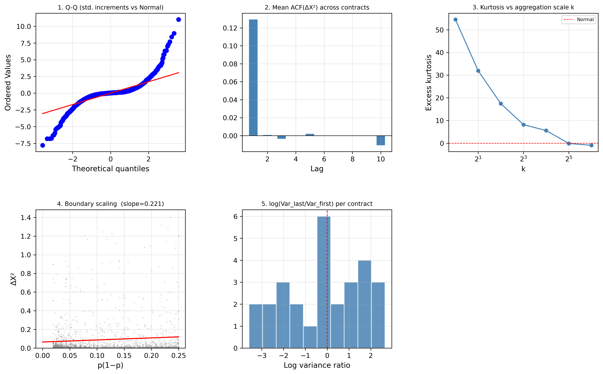
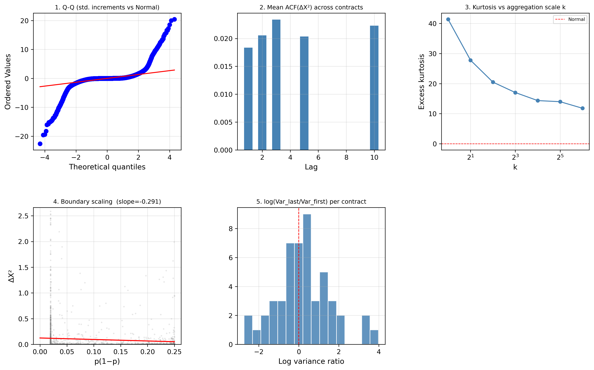
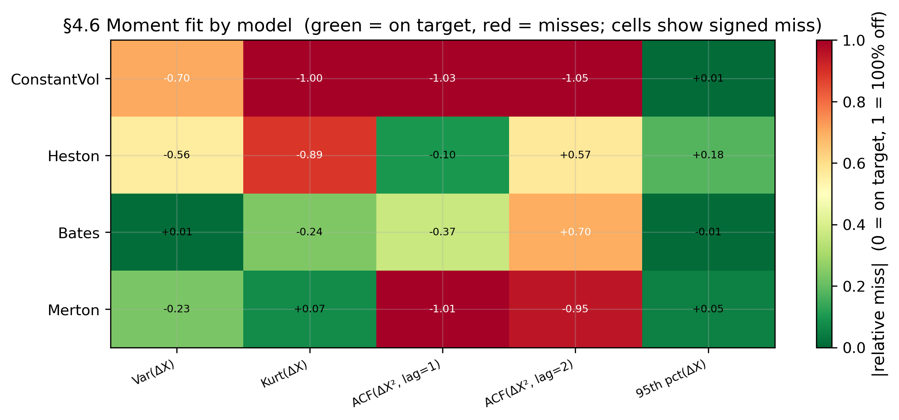
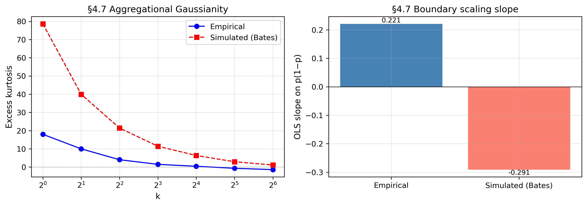

# Prediction Market Research

[](https://github.com/MilindCodes/prediction-market-research-v2/actions/workflows/ci.yml)
[](LICENSE)
[](https://www.python.org/downloads/)
[](https://github.com/astral-sh/ruff)

**Do prediction market prices exhibit stochastic volatility and jumps — and if
so, can standard option-pricing models capture them?**

This repository is the full research pipeline behind that question. It pulls
historical contract prices from **Kalshi** and **Polymarket**, extracts implied
volatility from binary contract prices, calibrates three nested option-pricing
models, and estimates a Bates jump-diffusion by **Simulated Method of Moments**
in log-odds space.

Everything is reproducible from a clean checkout: raw pulls, intermediate
artefacts, and final estimates are all version-controlled under `data/`.

---

## Key features

- **Two venues, one schema.** Kalshi (RSA-signed API) and Polymarket (Gamma +
  CLOB APIs) are normalised into a single contract/price panel.
- **Binary-option implied volatility.** IV is backed out of prediction market
  prices with the Cash-or-Nothing formula rather than assumed.
- **Three nested models.** Black-Scholes (1 parameter) → Heston (5) → Bates
  (8: Heston plus jumps), so the value of each added feature is measurable.
- **Formal model comparison.** MSE, AIC, BIC and QLIKE across every contract.
- **Simulated Method of Moments.** Bates estimated in log-odds space with a
  nested optimiser ladder, warm starts, and moment-selection diagnostics.
- **Robustness built in.** Sensitivity to sampling frequency, truncation,
  moment choice, and calendar bucketing are each their own pipeline step.
- **Reproducible by construction.** Committed data, deterministic steps, and a
  CLI that names every stage.

---

## The model

Bates dynamics, estimated in log-odds space with Δt = 1:

```
dX_t = √v_t · dW^X_t  +  J_t · dN_t
dv_t = κ(θ − v_t) dt  +  σ_v · √v_t · dW^v_t
corr(dW^X, dW^v) = ρ        (baseline: ρ = 0)
```

Prices are clipped to `[0.02, 0.98]` before the log-odds transform to keep
`log(p / (1 - p))` finite at the boundaries.

---

## Results at a glance

Figures are regenerated by `python run_pipeline.py plots` and
`python run_smm.py stylized-facts`.

| Stylised facts — real data | Stylised facts — simulated Bates |
| :---: | :---: |
|  |  |

| Moment selection | Bates validation |
| :---: | :---: |
|  |  |

Pure-diffusion and pure-jump synthetic controls used to check identification
live alongside these in [`data/processed/figures/`](data/processed/figures).

Numerical results are exported to [`data/exports/`](data/exports):
`model_comparison.csv`, `bates_params.csv`, `heston_params.csv`,
`implied_vol_all.csv`, and `smm_corpus_table.csv`.

---

## Quickstart

```bash
git clone https://github.com/MilindCodes/prediction-market-research-v2.git
cd prediction-market-research-v2

conda create -n pmr python=3.11 -y && conda activate pmr
pip install -r requirements.txt

python run_pipeline.py check
```

`check` verifies your Python version, confirms every dependency imports,
reports whether credentials are visible, and creates the `data/`
subdirectories. When it prints `Everything looks good`, you are ready.

Then either explore the committed results:

```bash
python run_pipeline.py compare    # Heston vs Bates: MSE, AIC, BIC, QLIKE
python run_pipeline.py plots      # regenerate every figure
python run_pipeline.py export     # write everything to CSV
```

…or re-run the collection from scratch (see
[Running the pipeline](#running-the-pipeline)).

---

## Installation

**Requirements:** Python **3.10 or newer**. The reference environment is
Python 3.11.

<details open>
<summary><b>conda</b> (recommended)</summary>

```bash
conda create -n pmr python=3.11 -y
conda activate pmr
pip install -r requirements.txt
```

</details>

<details>
<summary><b>venv</b></summary>

```bash
python3.11 -m venv .venv
source .venv/bin/activate      # Windows: .venv\Scripts\activate
pip install -r requirements.txt
```

</details>

For development work, also install the tooling:

```bash
pip install -r requirements-dev.txt
```

---

## Configuration

All settings live in [`config.py`](config.py). Credentials are read from
**environment variables only** — nothing is hardcoded, and nothing should ever
be committed.

### API credentials

**Polymarket needs no key.** The Gamma API is public.

**Kalshi** accepts either of two auth methods:

<details open>
<summary><b>Option A — RSA key file</b> (recommended)</summary>

Download a `.pem` from kalshi.com → Settings → API Keys → Create Key, then:

```bash
export KALSHI_KEY_FILE=~/.config/kalshi/kalshi-api-key.pem
export KALSHI_KEY_ID=<your-key-id>
```

</details>

<details>
<summary><b>Option B — Bearer token</b></summary>

```bash
export KALSHI_API_KEY=<your-token>
```

</details>

> [!WARNING]
> **Store the `.pem` outside this repository** and `chmod 600` it. A key
> committed once stays readable in git history forever, even after you delete
> the file. See [SECURITY.md](SECURITY.md).

### Research parameters

Edit these in `config.py` to change the study design:

| Setting | Default | What it controls |
| --- | --- | --- |
| `MIN_TRADE_COUNT` | `500` | Minimum trades for a contract to enter the sample |
| `MIN_DURATION_DAYS` | `14` | Minimum listing-to-resolution window |
| `LOG_ODDS_CLIP_LO` / `_HI` | `0.02` / `0.98` | Price bounds before the log-odds transform |
| `POLYMARKET_DATE_START` / `_END` | `2022-01-01` / `2024-12-31` | Polymarket sample window |
| `KALSHI_DATE_START` / `_END` | `2025-01-01` / `2026-12-31` | Kalshi sample window |
| `HOURLY_DT` / `DAILY_DT` | `1/(365.25·24)` / `1/365.25` | Time step for calibration |
| `FED_KEYWORDS`, `CPI_KEYWORDS` | — | Which markets count as macroeconomic |
| `FOMC_DATES` | 24 dates | FOMC statement release times (14:00 ET) |

> [!NOTE]
> The two venues cover different periods on purpose: Polymarket has full
> 2022–2024 history, while the Kalshi Elections API only reaches back to
> roughly 2025.

---

## Running the pipeline

Two entry points. Both print their own help.

```bash
python run_pipeline.py help
python run_smm.py help
```

### `run_pipeline.py` — collection, calibration, comparison

| # | Step | What it does |
| --- | --- | --- |
| 1 | `check` | Verify environment and credentials |
| 2 | `catalog-kalshi` | Pull and filter the Kalshi catalog |
| 3 | `catalog-polymarket` | Pull and filter Polymarket (no key needed) |
| 4 | `liquidity-kalshi` | Apply the trade-count filter |
| 5 | `trades-kalshi` | Pull hourly Kalshi trade data |
| 6a | `trades-sample` | 100-contract sample — fast, ~5–10 min |
| 6b | `trades-polymarket` | All Polymarket contracts — slow, ~30–60 min |
| 7 | `backtest-implied-vol` | Extract IV via Cash-or-Nothing |
| 8 | `backtest-bs` | Black-Scholes baseline (k = 1) |
| 9 | `backtest-heston` | Heston (k = 5) |
| 10 | `backtest-bates` | Bates — Heston plus jumps (k = 8) |
| 11 | `compare` | MSE, AIC, BIC, QLIKE across models |
| 12 | `plots` | Regenerate every figure |
| 13 | `export` | Write all results to CSV |
| 14 | `clean` | Clean datasets and flag degenerate fits |

> [!NOTE]
> After step 4 the pipeline pauses so you can review
> `data/raw/*/contracts_for_review.csv` by hand before committing to a long
> trade pull.

### `run_smm.py` — Section 4, Simulated Method of Moments

Builds the price panel, computes stylised facts, estimates Bates by SMM through
a nested optimiser ladder, and runs the sensitivity analyses. Run
`python run_smm.py help` for the current step list.

---

## Repository layout

```
.
├── config.py                  # All research parameters and credential wiring
├── run_pipeline.py            # CLI: collection → calibration → comparison
├── run_smm.py                 # CLI: Section 4 SMM estimation
├── src/
│   ├── kalshi/                # RSA-signed client, catalog, trade puller
│   ├── polymarket/            # Gamma + CLOB clients, catalog, trade puller
│   ├── models/                # black_scholes, heston, bates, implied_vol
│   ├── smm/                   # panel, stylized_facts, bates_smm, nested_ladder
│   └── cleaning.py            # Quality flags and degenerate-fit detection
├── analysis/
│   ├── model_comparison.py    # MSE, AIC, BIC, QLIKE
│   └── plots.py               # Every figure in the write-up
├── consolidated/pipeline.py   # Single-file consolidated runner
├── tests/                     # Config invariants, import wiring, repo hygiene
├── notebooks/                 # Exploratory work
└── data/
    ├── raw/                   # Untouched API pulls
    ├── processed/             # Panels, fitted parameters, figures
    └── exports/               # Analysis-ready CSVs
```

---

## Data

`data/` is committed deliberately so published numbers can be reproduced
without re-pulling from the APIs.

| Directory | Contents |
| --- | --- |
| `data/raw/` | Verbatim API responses — catalogs and per-contract price history |
| `data/processed/` | Fitted parameters per model, SMM panels, figures |
| `data/exports/` | Flat CSVs ready for a spreadsheet or a paper table |

Collection methodology — pull dates, endpoints, filters, and how gaps were
handled — is documented in
[`docs/data-collection-protocol.md`](docs/data-collection-protocol.md).

---

## Development

```bash
pip install -r requirements-dev.txt

ruff check .          # lint
ruff format .         # format
pytest -q             # tests
```

CI runs linting, a credential scan, and the test suite on Python 3.10 and 3.11
for every push and pull request. See [CONTRIBUTING.md](CONTRIBUTING.md).

---

## Citing this work

```bibtex
@misc{chaturvedi_prediction_market_research,
  author = {Chaturvedi, Milind},
  title  = {Prediction Market Research: Stochastic Volatility and Jumps
            in Binary Contract Prices},
  year   = {2026},
  url    = {https://github.com/MilindCodes/prediction-market-research-v2}
}
```

---

## Disclaimer

This is academic research code. It is **not** investment advice, and it is not
a trading system. Nothing here should be used to make financial decisions.

---

## Contributing, conduct, and security

- [CONTRIBUTING.md](CONTRIBUTING.md) — setup, style, and pull request guidelines
- [CODE_OF_CONDUCT.md](CODE_OF_CONDUCT.md) — Contributor Covenant v2.1
- [SECURITY.md](SECURITY.md) — how to report a vulnerability, and credential handling

## License

Licensed under the [Apache License 2.0](LICENSE).
